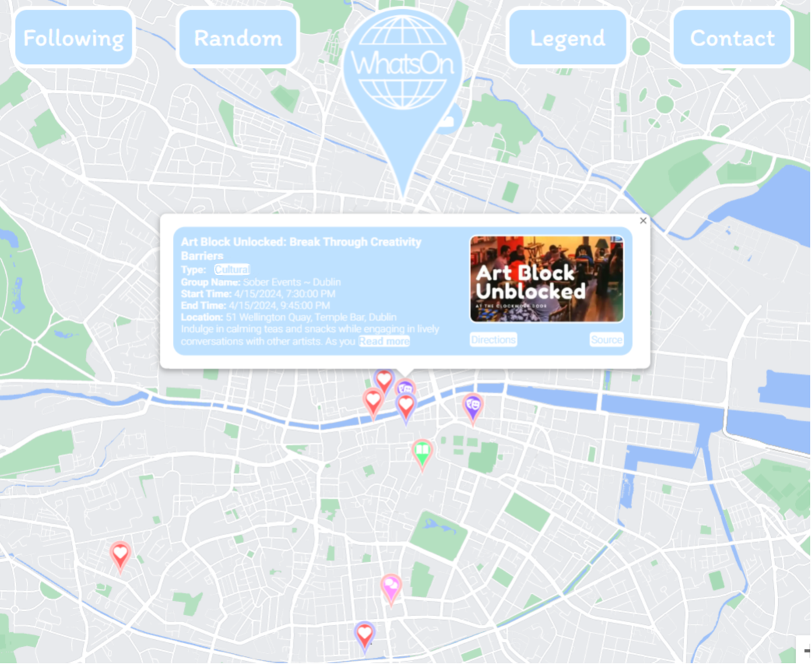
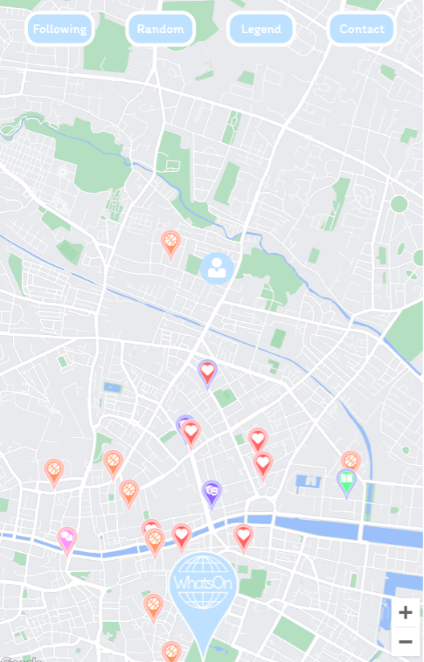

# WhatsOn: Real-Time Event Discovery App

Discover events happening around you in real time with **WhatsOn**—a map-based web application that promotes spontaneity and simplifies event discovery.

## Overview

WhatsOn is designed to make finding and attending events effortless. With a focus on simplicity and spontaneity, the app displays events happening within the next 24 hours directly on an interactive map. No registrations or complex menus—just open the app and start exploring!

## Features

- **Interactive Map Interface**: View events around you on an intuitive map.
- **Event Filtering**: Filter events by type to see only what interests you.
- **Real-Time Updates**: Events appear when they're imminent, ensuring you always have up-to-date information.
- **Random Event Selector**: Feeling adventurous? Let the app suggest a random event for you.
- **Directions**: Get instant directions to events via Google Maps or other mapping services.

## Documentation

For an in-depth look at the development of WhatsOn, check out our comprehensive documentation:

1. **[Project Proposal](./documentation/Project_Proposal.pdf)**: Overview of the project, market research, and application features.
2. **[Requirements Specification](./documentation/Requirements_Specification.pdf)**: Detailed functional and non-functional requirements.
3. **[Technical Report](./documentation/Technical_Report.pdf)**: System architecture, implementation challenges, and technology stack.
4. **[Business Plan](./documentation/Business_Plan.pdf)**: Business concept, market analysis, and strategic positioning.
5. **[Testing Report](./documentation/Testing_Report.pdf)**: Testing strategies and results to ensure functionality and user experience.
6. **[Presentation Slides](./documentation/Presentation_Slides.pdf)**: Visual summary of the project and key outcomes.


## Demo

- **[Watch Demo Video](https://youtu.be/ffd4UqCUldw)**: See WhatsOn in action.
- **[Try the App Live](https://whatson-kbt9.onrender.com)**: *Note: The deployed app requires an encrypted API key to function properly.*

## Getting Started

### Prerequisites

- **Node.js and npm**: Install from the [official website](https://nodejs.org/).
- **Google Maps API Key**: Obtain one from the [Google Cloud Console](https://console.cloud.google.com/).
  - *Note: An encrypted API key is required for the app to function correctly.*

### Installation

1. **Install dependencies**:

   ```bash
   npm install
   ```

2. **Configure API Key**:

   - Create a `.env` file in the root directory.
   - Add your encrypted API key:

     ```env
     ENCRYPTED_GOOGLE_MAPS_API_KEY=your_encrypted_google_maps_api_key
     ```

3. **Start the app**:

   ```bash
   npm start
   ```

   *Alternatively, use Nodemon for automatic restarts during development:*

   ```bash
   npx nodemon app.js
   ```

4. **Visit the app**:

   Open [http://localhost:3000](http://localhost:3000) in your browser.

## Usage

1. **Open the App**: Launch WhatsOn and allow location permissions.
2. **Explore Events**: Browse events displayed on the map in your vicinity.
3. **Filter Events**: Click on an event icon or use the legend to filter events by type.
4. **Random Event**: Click the random event button for a surprise activity.
5. **Event Details**: Select an event marker to view more information.
6. **Get Directions**: Use the directions link to navigate to the event.

## Diagrams

### Map View

### Desktop View


*Explore events on the desktop interface, showing all event pins and filtering options.*

### Mobile View


*Explore events using the mobile interface, optimized for smaller screens.*

### Use Case Diagram


*A high-level view of the main interactions between the user and the WhatsOn system.*


## Technologies Used

### Frontend

- **HTML**: Defines the structure and content of the webpage.
- **EJS**: Easier management of HTML files and live injection of data such as JSON data.
- **CSS**: Styles all the HTML content.
- **JavaScript**: Used extensively to achieve all use cases, including loading and initializing the map, creating markers, info windows, grabbing the user's location and event data, etc.

### Backend

- **Node.js**: Backend server used to load the webpage and domain services.
- **Render**: Deployed website hosting.
- **Express.js**: Node.js framework to handle backend requests.
- **Morgan**: Logging middleware to check code status, resources, 404 errors, etc.
- **Bcrypt**: Library to encrypt user passwords.
- **Crypto**: Encrypting Google Maps API key.
- **Axios**: Web crawler to make HTTP calls to servers to pull data.
- **Cheerio**: Parses and reads data.
- **FS (File System)**: Writes data to a JSON file.

### APIs

- **Google Maps API**: For map content.
- **Maps JavaScript API**: To load and manipulate map content.
- **Google Cloud Console**: To create API keys, map styles, security restrictions, etc.

### Graphic Design

- **PhotoPea**: Icon design.
- **Figma**: Wireframes and mockups.
- **Pixelmator Pro**: Icon design.

### Project Management

- **Trello**: To assign and manage tasks.
- **Microsoft Teams**: To communicate and transfer files.
- **OneDrive**: To store shared documents and files.

## Contributors

- **Conor Judge**: Project Manager. Responsible for all documentation, diagrams, app design, implementation of 5 out of 7 use cases, and JavaScript functionality.
- **Eoin Fitzsimons**: Visual design, event data handling, API key security.
- **David O'Connor**: Backend navigation, account management, contact feature.

## Future Developments

We aim to enhance WhatsOn with:

- **OpenStreetMaps Integration**: Offering alternative mapping options.
- **Native Mobile App**: Developing apps for iOS and Android.
- **Advanced Personalization**: Improved filtering and personalized recommendations.
- **Social Features**: Event sharing, friend lists, and group planning.


## Troubleshooting

- **Dependencies**:

  - Run `npm install` to ensure all dependencies are installed.
  - If issues persist, delete `node_modules` and reinstall:

    ```bash
    rm -rf node_modules
    npm install
    ```

- **Port Conflicts**:

  - Ensure port `3000` is free or change it in the `.env` file:

    ```env
    PORT=your_desired_port
    ```

- **API Key Issues**:

  - Verify your Google Maps API key is correct and active.
  - Ensure the key is properly referenced in your `.env` file.
  - **Security Reminder**: Never commit your `.env` file or API keys to version control. Add `.env` to your `.gitignore` file.

## Acknowledgments

- **Third-Party Libraries**:

  - [Express.js](https://expressjs.com/)
  - [EJS](https://ejs.co/)
  - [Axios](https://axios-http.com/)
  - [Morgan](https://github.com/expressjs/morgan)
  - [Bcrypt](https://github.com/kelektiv/node.bcrypt.js)
  - [Crypto](https://nodejs.org/api/crypto.html)
  - [Cheerio](https://cheerio.js.org/)
  - [FS (File System)](https://nodejs.org/api/fs.html)

- **APIs**:

- [Google Maps API](https://developers.google.com/maps): For map content.
- [Maps JavaScript API](https://developers.google.com/maps/documentation/javascript/overview): To load and manipulate map content.
- [Google Cloud Console](https://console.cloud.google.com/): To create API keys, map styles, security restrictions, etc.

- **Design Tools**:

  - [PhotoPea](https://www.photopea.com/)
  - [Figma](https://www.figma.com/)
  - [Pixelmator Pro](https://www.pixelmator.com/pro/)


---

Thank you for choosing **WhatsOn**! We hope it helps you discover exciting events happening around you.
